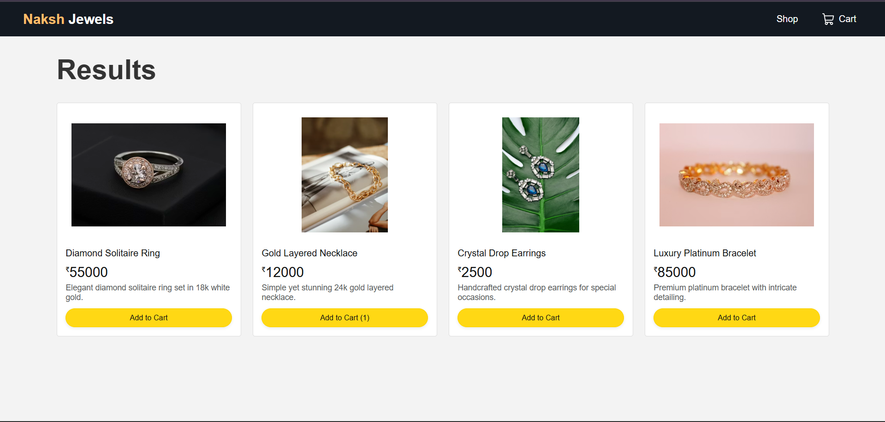
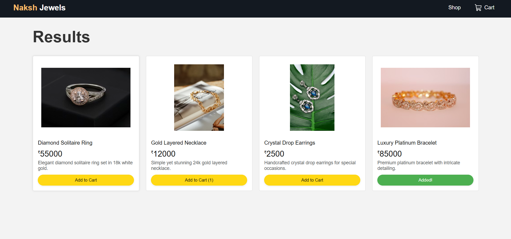
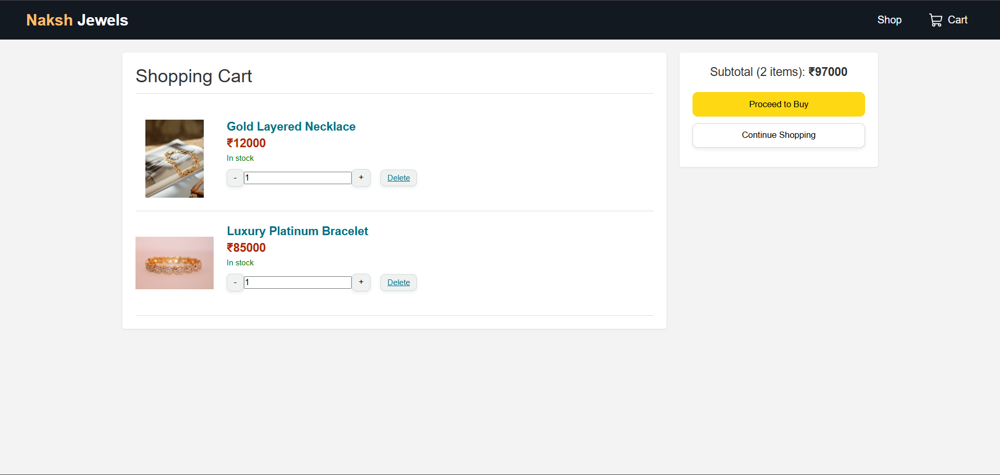
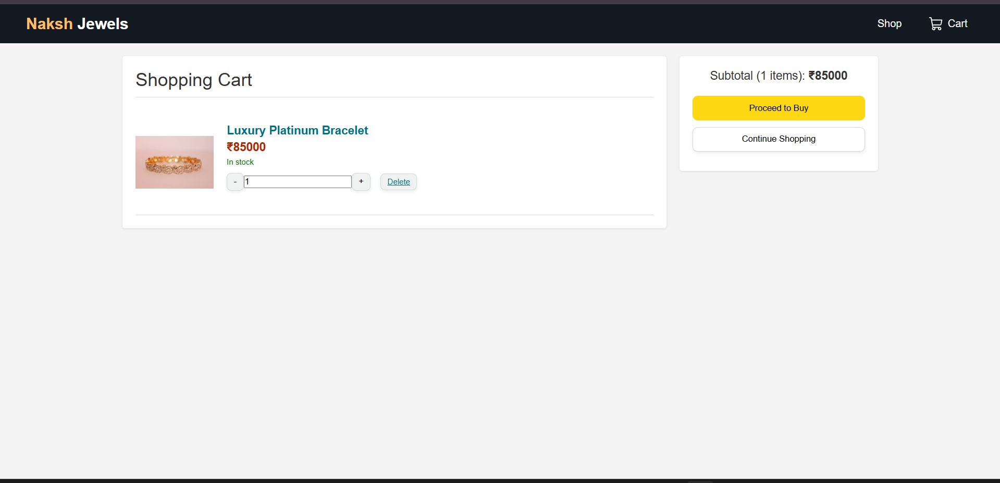

# Naksh Jewels Internship Assessment

A production-ready e-commerce module built with **React**, **Node.js**, and **MongoDB**, fully containerized with **Docker**.

## 🚀 Overview

This project is a mini e-commerce application designed to demonstrate clean code, scalable structure, and practical implementation of modern web technologies. It features a responsive UI, state management, and a persistent backend.

### Key Features
- **Product Listing**: Dynamic grid layout fetching data from MongoDB.
- **Shopping Cart**: Add, update quantity, and remove items with real-time state management.
- **Responsive UI**: "Amazon-like" aesthetic with a full-screen welcome page.
- **Dockerized**: One-command setup for the entire stack (Frontend + Backend + Database).

---

## 🛠️ Tech Stack

- **Frontend**: React.js (Vite), Context API, CSS3 (Custom Properties & Grid)
- **Backend**: Node.js, Express.js
- **Database**: MongoDB (via Docker)
- **DevOps**: Docker, Docker Compose

---

## ⚙️ Prerequisites

- [Docker Desktop](https://www.docker.com/products/docker-desktop) installed and running.

---

## 🏃‍♂️ How to Run

1. **Clone the Repository**
   ```bash
   git clone <repository-url>
   cd <repository-directory>
   ```

2. **Run with Docker Compose** (Recommended)
   This command builds the images and starts all services (Frontend, Backend, Database).
   ```bash
   docker-compose up --build
   ```

3. **Access the Application**
   - **Frontend**: [http://localhost:3000](http://localhost:3000)
   - **Backend API**: [http://localhost:5000](http://localhost:5000)

---

## 📸 Screenshots

**1. Welcome Page**
*(Full-screen immersive landing page with navigation)*


**2. Product Listing (Shop)**
*(Responsive grid layout displaying all available products)*


**3. Product Card "Added" State**
*(Visual feedback when an item is added to the cart)*


**4. Shopping Cart**
*(Detailed view of cart items with quantity controls)*


**5. Checkout / Mobile View**
*(Responsive view or checkout summary section)*


---

## 📂 Project Structure

```
├── backend/
│   ├── models/         # Mongoose Schemas (Product, Cart)
│   ├── server.js       # Express App & API Routes
│   ├── Dockerfile      # Backend Container Config
│   └── package.json    # Backend Dependencies
│
├── frontend/
│   ├── public/         # Static assets
│   ├── src/
│   │   ├── components/ # Reusable UI Components
│   │   ├── context/    # Global State (ShopContext)
│   │   ├── pages/      # Route Components (Shop, Cart, Welcome)
│   │   └── App.jsx     # Main Layout & Routing
│   ├── Dockerfile      # Frontend Container Config
│   └── vite.config.js  # Vite Config
│
└── docker-compose.yml  # Orchestration Config
```

---

## 🔌 API Endpoints

| Method | Endpoint    | Description |
| :---   | :---        | :--- |
| `GET`  | `/products` | Fetch all available products. |
| `POST` | `/cart`     | Add an item or update its quantity in the cart. |
| `GET`  | `/cart`     | Retrieve current cart items. |

---

## ✅ Evaluation Checklist

- [x] **Frontend**: React, Functional Comp., No UI Libs, Responsive.
- [x] **Backend**: Node/Express, MongoDB, Validation, Error Handling.
- [x] **Docker**: Frontend & Backend Dockerfiles, docker-compose.yml.
- [x] **Code Quality**: Clean structure, meaningful naming.

---
**Developed by:** Bhuvan
